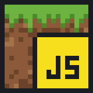
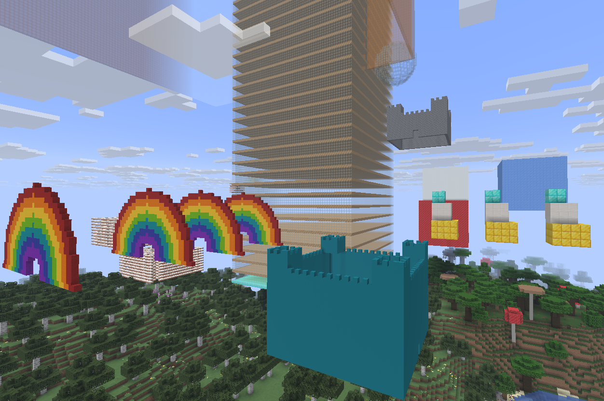

<p align="center">
  
</p>

<h1 align="center">JSMN — JavaScript in Minecraft</h1>

A Spigot plugin that lets pupils write and run JavaScript files directly inside
a Minecraft server. Scripts can interact with the world, build structures,
generate mazes and castles, and much more — making Minecraft a live coding
environment for kids.

A custom GUI with an integrated code editor was built for the pupils so they
can write and run their scripts without leaving their workspace. This plugin was
created alongside it to handle script execution and maintenance on the server.



<p align="center"><em>Rainbows, castles and a tower — all built by pupils' scripts.</em></p>

---

## Acknowledgement

JSMN is inspired by **ScriptCraft**, the pioneering plugin by
[Walter Higgins](https://github.com/walterhiggins/ScriptCraft) that made it
possible to teach children programming through Minecraft. Walter showed that
Minecraft is not just a game — it is one of the best tools ever made for
getting kids excited about writing code.

JSMN exists to keep that tradition alive.

> ScriptCraft repository: https://github.com/walterhiggins/ScriptCraft

Thank you, Walter.

---

## Stack

- **Java** — Spigot plugin, command handling, Minecraft API
- **GraalVM Polyglot** — executes pupil JavaScript inside the JVM
- **JavaScript** — pupil-authored scripts
- **Maven** — build system

## Installation

JSMN is a standard Spigot plugin. **No modifications to Spigot are needed.**

1. Download the jar for your server from the [Releases](https://github.com/cndrbrbr/Script4kids/releases) page —
   each Minecraft version has its own release (e.g. `v1.1.0-mc1.21.11` for Spigot 1.21.11 on Java 21,
   `v1.1.0-mc26.3` for Spigot 26.3 on Java 25) — and copy the jar into the server's `plugins/` folder.
2. Start the server with the following JVM flags (GraalVM needs access to JDK internals at runtime):

```bash
java -Xmx2G \
  -XX:+UnlockExperimentalVMOptions -XX:+EnableJVMCI \
  --add-opens=java.base/java.lang=ALL-UNNAMED \
  --add-opens=java.base/java.lang.invoke=ALL-UNNAMED \
  --add-opens=java.base/java.lang.ref=ALL-UNNAMED \
  --add-opens=java.base/java.nio=ALL-UNNAMED \
  --add-opens=java.base/java.util=ALL-UNNAMED \
  --add-opens=java.base/jdk.internal.misc=ALL-UNNAMED \
  -Dpolyglot.engine.WarnInterpreterOnly=false \
  -jar spigot.jar nogui
```

The plugin runs on standard **OpenJDK 21**. Scripts execute in GraalVM interpreter mode, which is fast enough for teaching purposes.

3. Put `.js` script files into `plugins/jsmn/scripts/`.

### Script upload page

The plugin starts a small web server on port `25580` (configurable). Players open it in any browser to upload scripts from their computer:

```
http://<server>:25580/
```

The page has a Minecraft username field, a file picker (click or drag & drop), and an Upload button. The script name is taken from the filename automatically. After uploading, the script is immediately available via `/runscript`.

The server checks that the entered Minecraft username is currently logged in. Uploads from players who are not online are rejected with a `403` error.

If `upload-api-key` is set in `plugins/jsmn/config.yml`, append it to the URL:
```
http://<server>:25580/?key=<secret>
```

The HTTP endpoint (`POST /upload`) also accepts programmatic requests, so the custom GUI can upload files directly without using the browser page. CORS headers are included.

### Workshop setup

JSMN is designed for coding workshops and classroom sessions:

1. Start a laptop or server running Spigot with JSMN on a local network.
2. All participants connect to the same Wi-Fi.
3. Every participant joins the Minecraft server with their username. **They must be logged in** — the server verifies this before accepting any upload.
4. Everyone opens `http://<server>:25580/` in their browser.
5. Each participant writes a script, saves it as a `.js` file, and uploads it with their Minecraft name.
6. The script appears in their personal folder instantly — run it with `/runscript <name>`.

No shared drives, no USB sticks, no copy-pasting. Each participant works in their own folder and can browse and run each other's scripts with `/listscripts` and `/runscript <player>/<name>`. The login check also prevents accidentally uploading under someone else's name.

> **Note:** Do not use `/reload` or `/reload confirm`. GraalVM's native library cannot be reloaded in the same JVM process. Always do a full server restart after updating the plugin JAR.

## Build

```bash
mvn clean package -DskipTests              # Spigot 1.21.11 → target/jsmn-<version>-mc1.21.11.jar
mvn clean package -DskipTests -P mc-26.3   # Spigot 26.3    → target/jsmn-<version>-mc26.3.jar
cp target/jsmn-*.jar /path/to/spigot/plugins/
```

Building the `mc-26.3` profile needs JDK 25+ (Spigot 26.x itself runs on Java 25).
CI builds both jars on every push. A tag `v<version>-mc<minecraft>` (e.g. `v1.1.0-mc26.3`)
publishes a separate GitHub Release containing only the jar for that Minecraft version.

## Commands

Each player has a personal scripts folder at `plugins/jsmn/scripts/<PlayerName>/`.
`/runscript` checks the player's own folder first, then the shared folder.
Use `/runscript Steve/castle` to run another player's script.

| Command | Description |
|---|---|
| `/savescript <name> <content>` | Save a script to your personal folder |
| `/savescript <name> <content>` | Save a script to your personal folder |
| `/myscripts` | List only your own personal scripts |
| `/listscripts` | List all scripts — yours, other players', and shared |
| `/runscript <file>` | Run a script (own folder first, then shared) |
| `/box <material> [w] [h] [d]` | Place a solid box |
| `/box0 <material> [w] [h] [d]` | Place a hollow box |
| `/sphere <material> [radius]` | Build a solid sphere |
| `/sphere0 <material> [radius]` | Build a hollow sphere |
| `/maze <material> <cols> <rows> [height]` | Generate a random maze |
| `/rainbow [radius]` | Build a rainbow arch |
| `/castle <material> [side] [height]` | Build a castle |

All commands have tab completion for material names and script filenames.

## Project Structure

```
src/main/java/com/jsmn/plugin/
  Main.java                  Plugin entry point
  ScriptManager.java         Loads and executes scripts via GraalVM
  commands/                  One class per command
  api/                       Java objects exposed to JavaScript
    PlayerAPI.java
    ConsoleAPI.java
    DroneAPI.java

src/main/resources/
  plugin.yml                 Command and permission definitions
  config.yml                 Plugin configuration

scripts/                     Example scripts for pupils
HANDBUCH.txt                 Full user guide with examples
```

## JavaScript API

Every script has access to:

- **`player`** — `getName()`, `sendMessage()`, `getX/Y/Z()`, `getHealth()`
- **`drone`** — builder object starting at the player's position:
  `box`, `box0`, `sphere`, `sphere0`, `maze`, `castle`, `rainbow`,
  `fwd`, `back`, `left`, `right`, `up`, `down`, `turn`, `chkpt`, `move`

See `HANDBUCH.txt` for the full reference and example scripts.
